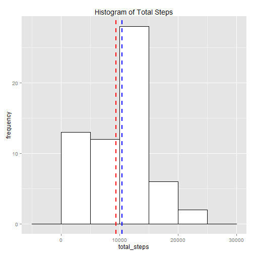

## Loading and preprocessing the data
The data is stored in the zip file repdata-data-activity.zip. We will first, unzip this file and load the data into data frame mydt. We see that the data frame has 3 columns
- date
- interval
- steps
The date column is stored as a factor. So, we will create a new column called Date where we will convert this into POSIXct date format and get rid of the existing date column. Then we will reorder the columns. To do this, we will use the data.table, lubridate, dplyr packages


```r
library(dplyr)
library(data.table)
library(lubridate)
```

Now, we read and preprocess the data

```r
unzip("./repdata-data-activity.zip")
mydt <- read.csv("activity.csv")
#convert mydt to data.table
mydt <- data.table(mydt)
mydt$Date <- ymd(mydt$date)
mydt <- mydt %>% select(-date) %>% setcolorder(c(3,1,2))
head(mydt)
```

```
##          Date steps interval
## 1: 2012-10-01    NA        0
## 2: 2012-10-01    NA        5
## 3: 2012-10-01    NA       10
## 4: 2012-10-01    NA       15
## 5: 2012-10-01    NA       20
## 6: 2012-10-01    NA       25
```


## What is mean total number of steps taken per day?
Now, we do a histogram of the total steps taken in a day and in this histogram we will also indicate the mean and median of the total steps taken in a day (Mean will be drawn a red dotted line and Medial will be drawn as a blue dotted line). To enable us to do this histogram, we will group_by and summarize the data to get the total steps on each day. We will use the ggplot2 to draw the histogram.


```r
t <- mydt %>% group_by(Date) %>% summarize(total_steps=sum(steps, na.rm=TRUE))
head(t)
```

```
##         Date total_steps
## 1 2012-10-01           0
## 2 2012-10-02         126
## 3 2012-10-03       11352
## 4 2012-10-04       12116
## 5 2012-10-05       13294
## 6 2012-10-06       15420
```

Now that we have created the new data structure with the total_steps on each day, let us draw a histogram using ggplot. The mean value of total steps will be represented by a red line and the median value will be represented by a blue line.


```r
library(ggplot2)
g <- ggplot(t, aes(x=total_steps)) + labs(title="Histogram of Total Steps") +
    ylab("frequency") +
    geom_histogram(binwidth=5000, color="black", fill="white") +
    geom_vline(aes(xintercept=mean(total_steps, na.rm=TRUE)), 
               color="red", linetype="dashed", size=1) +
    geom_vline(aes(xintercept=median(total_steps, na.rm=TRUE)), 
               color="blue", linetype="dashed", size=1)
g
```

 


## What is the average daily activity pattern?
To get the average daily patter, we will first create a data frame that has the average steps in every 5 minute interval across all days. Then we use this data frame to draw a plot. On the plot, we draw a line on the interval containing the maximum average steps.


```r
t <- mydt %>% group_by(interval) %>% summarize(avg_steps=mean(steps, na.rm=T))
p <- ggplot(data=t, aes(x=interval, y=avg_steps)) + geom_line() +
    labs(title="Line Graph of average steps in 5 Min Intervals")
a <- t[avg_steps==max(t$avg_steps), ]
p <- p + geom_vline(aes(xintercept=a$interval), linetype="dashed")
p <- p + scale_x_continuous(breaks= c(seq(0,2000,by=500),a$interval),
                            labels=c(seq(0,2000,by=500),a$interval))
p
```

 

## Imputing missing values
1. Calculate and report the total number of missing values in the dataset (i.e. the total number of rows with NAs)

We first create a new data frame where steps has NA and count the rows in that data fram


```r
a <- mydt[is.na(mydt$steps), ]
nrow(a)
```

```
## [1] 2304
```

2. Devise a strategy for filling in all of the missing values in the dataset. The strategy does not need to be sophisticated. For example, you could use the mean/median for that day, or the mean for that 5-minute interval, etc.
3. Create a new dataset that is equal to the original dataset but with the missing data filled in.

(a) We will create a new data frame that has the average steps in that interval across all and then merge it with the data frame with mising values (created in previous step).

(b) We will create a data frame from mydt by eliminating the NAs in the steps column

(c) We will rbind the data frames created in the 2 steps above. This will give us a complete data set with NAs being replaced by the interval averages


```r
#(a) We create a data frame with just NULL
a <- mydt[is.na(mydt$steps), ]
#We create a new df with interval averages
int_avg <- mydt %>% group_by(interval) %>% 
    summarize(avg_steps=mean(steps, na.rm=T))
b <- merge(int_avg, a, by="interval")
b <- select(b, -steps)
setcolorder(b, c(3,2,1))
setnames(b, c("Date", "steps", "interval"))

#(b) We will create a data frame from mydt by eliminating NAs in steps
c <- mydt[!is.na(mydt$steps), ]

#(c) rowbind the 2 data frames and arrange the rows
full <- rbind(c, b)
arrange(full, Date, interval)
```

```
##              Date     steps interval
##     1: 2012-10-01 1.7169811        0
##     2: 2012-10-01 0.3396226        5
##     3: 2012-10-01 0.1320755       10
##     4: 2012-10-01 0.1509434       15
##     5: 2012-10-01 0.0754717       20
##    ---                              
## 17564: 2012-11-30 4.6981132     2335
## 17565: 2012-11-30 3.3018868     2340
## 17566: 2012-11-30 0.6415094     2345
## 17567: 2012-11-30 0.2264151     2350
## 17568: 2012-11-30 1.0754717     2355
```

4. Make a histogram of the total number of steps taken each day and Calculate and report the mean and median total number of steps taken per day. Do these values differ from the estimates from the first part of the assignment? What is the impact of imputing missing data on the estimates of the total daily number of steps?


```r
t4 <- full %>% group_by(Date) %>% summarize(total_steps=sum(steps, na.rm=TRUE))
g <- ggplot(t4, aes(x=total_steps)) + labs(title="Histogram of Total Steps") +
    ylab("frequency") +
    geom_histogram(binwidth=5000, color="black", fill="white") +
    geom_vline(aes(xintercept=mean(total_steps, na.rm=TRUE)), 
               color="red", linetype="dashed", size=1) +
    geom_vline(aes(xintercept=median(total_steps, na.rm=TRUE)), 
               color="blue", linetype="dashed", size=1)
g
```

 

From the above graph, we see that the histogram shape has changed and the mean and median have converged

## Are there differences in activity patterns between weekdays and weekends?
